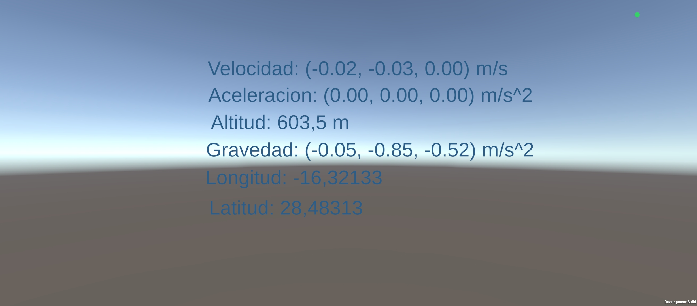
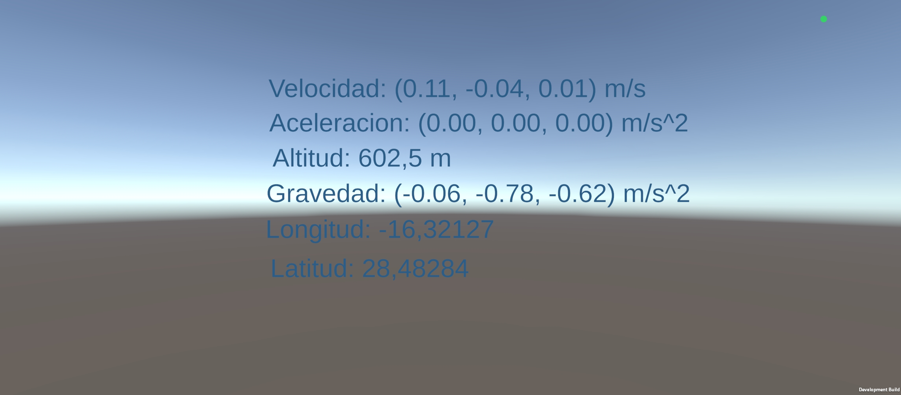

## Primera parte
### Mediciones en el laboratoria

### Mediciones en el jardín de la ESIT

## Segunda parte
A continuación se muestra un gif probando como se desplaza el samurai según donde se encuentra el norte y la inclinación del dispositivo.

 
